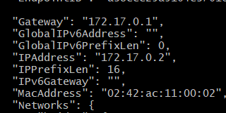
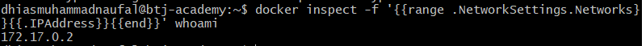
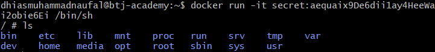
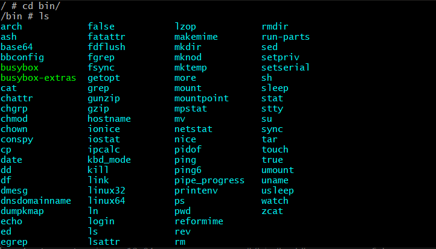
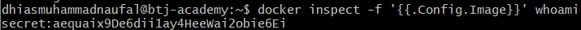
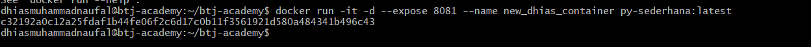

# Simple Test - Dhias MN

- Membuat image pada VM
- Menjalankan Image Container
- Mencari IP Docker container `whoami`
- Apa isi data tersembunyi pada docker `whoami`
- Image apa yang digunakan pada container `whoami`

## Membuat Image pada VM

Membuat docker file pada repository aplikasi yang dibuat sebelumnya
`Dockerfile`:

```
FROM ubuntu:20.04

RUN apt-get update && \
    apt-get install -y python3 python3-pip
WORKDIR /app
COPY . .
EXPOSE 8081

CMD ["python3", "app/persegi.py"]

```

Push file `Dockerfile` pada remote repository.

```
git add Docker file

git commit -m "Membuat Docker File"

git push origin main
```

Buka akses `VM` lalu clone repository

```
git clone https://github.com/DhiasNaufal/btj-academy.git
```

Buat image dari Docker file tersebut [`Dockerfile`]

```
docker build -t py-sederhana .
```

membuat image dengan nama `py-sederhana`

## Menjalankan Image Container

Jalankan image tersebut ke dalam Container

```
docker run -it -d --expose 8081 --name new_dhias_container py-sederhana:latest
```

- `8081` sebagai port dijalankannya Container
- `--name` diberi nama `new_dhias_container`
- Image `py-sederhana` dengan tag `latest`

## Ip Address

Untuk mengetahui IP Address menggunakan perintah `inspect`

```
docker inspect whoami
```

ini akan memberikan seluruh informasi mengenai container `whoami`. IP Addressnya adalah `170.17.0.2`

Atau bisa juga dengan

```
docker inspect -f '{{range .NetworkSettings.Networks}}{{.IPAddress}}{{end}}' whoami

```



## Isi Data container `whoami`

Mencari tau asal image container `whoami`

```
docker inspect -f '{{.Config.Image}}' whoami
```

Image yang didaptkan adalah `secret:aequaix9De6dii1ay4HeeWai2obie6Ei`, lalu akses image tersebut dengan command

```
docker run -it secret:aequaix9De6dii1ay4HeeWai2obie6Ei /bin/sh
```

lalu cek directorynya

```
ls
```


pada `sh`


## Image pada container `whoami`

```
docker inspect -f '{{.Config.Image}}' whoami
```



