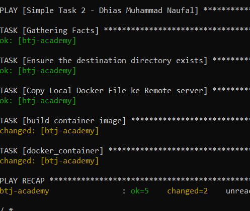
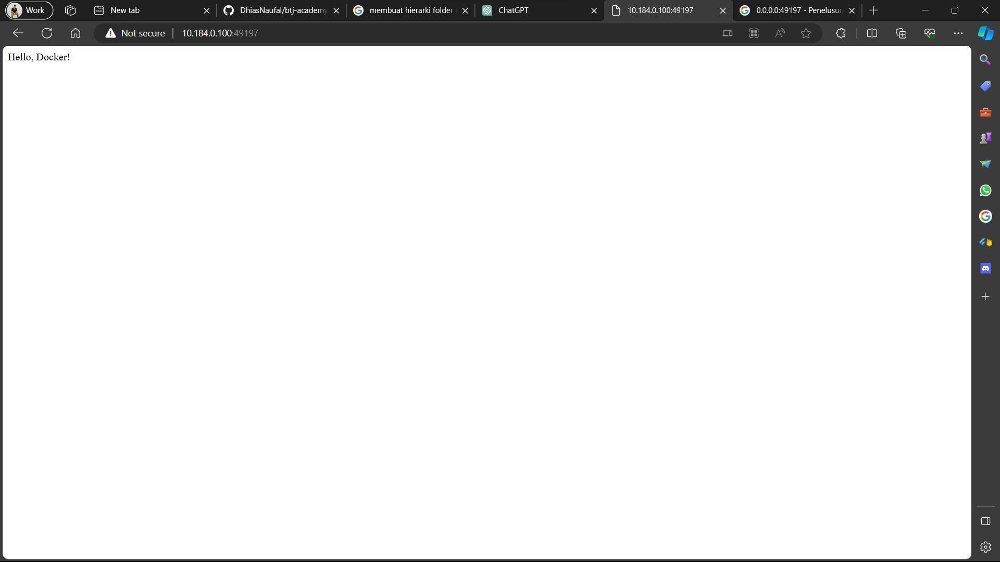

# Simple Task 2

1. Clone Example App

```bash
git clone https://github.com/rrw-bangunindo/btj-academy.git
```

2. Menambahkan route dan custom port `8080`

```python

from flask import Flask
app = Flask(__name__)

@app.route('/')
def hello_world():
    return 'Hello, Docker!'

@app.route('/page2')
def about():
    return 'Ini page ke 2'

@app.route('/page3')
def contact():
    return 'ini page ke 3'

if __name__ == '__main__':
    app.run(debug=True,host='0.0.0.0', port=8080)
```

3. siapkan app tersebut ke dalam sebuah folder yang sudah berisikan `inventory.yaml` dan `playbook.yaml` untuk dibuatkan sebuah docker container dengan ansible didalamnya di local

```lua
project-root/
|-- Dockerfile <--local ansible
|-- inventory.yaml
|-- playbook.yaml
|-- app/
|  |-- app.py
|  |-- requirements.txt
|  |-- Dockerfile <-- remote image
```

4. Siapkan task dalam playbook

```yaml
- name: Simple Task 2 - Dhias Muhammad Naufal
  hosts: btj-academy
  become: true
  vars:
    local_directory: ./app/
    remote_directory: /home/ubuntu/my_directory
  tasks:
    - name: Ensure the destination directory exists
      ansible.builtin.file:
        path: "/home/dhiasmuhammadnaufal/simple-task"
        state: directory

    - name: Copy Local Docker File ke Remote server
      copy:
        src: "./app/"
        dest: "/home/dhiasmuhammadnaufal/simple-task"

    - name: build container image
      docker_image:
        name: simple-task-2-dhias
        source: build
        build:
          path: /home/dhiasmuhammadnaufal/simple-task/
        state: present

    - docker_container:
        name: ubuntu-ansible
        image: "simple-task-2-dhias"
        interactive: true
        tty: true
        ports:
          - "8080"
```

5. Build Ansible Image local

```bash
docker build -t ansi-imge .
```

6. Jalankan container ansible local

```bash
docker run -it -d -v C:/Users/ASUS\.ssh\:/root/.ssh/ --name ansible ansi-img
```

7. Masuk ke dalam running container

```bash
docker exec -it remote-task1 sh
```

8. Install openssh

```bash
apk add openssh
```

9. Jalankan Ansible

```bash
ansible-playbook -i inventory.yaml playbook.yaml --user dhiasmuhammadnaufal
```

10. Cek apakah semua task sudah berjalan <br>
     <br>
11. Cek running container pada remote server
    
12. Cek port pada browser

```WWW
http://10.184.0.100:49197/
http://btj-academy.bangunindo.io:49197/
http://btj-academy.bangunindo.io:49197/page2
http://btj-academy.bangunindo.io:49197/page3
```



# Simple Task - Ansible

1. Konfigurasi ansible pada docker

```dockerfile
FROM python:3.9-alpine

RUN apk update && apk add build-base libffi-dev

RUN pip3 install ansible

WORKDIR /app

COPY . .

EXPOSE 8081

CMD ["python3", "app/running.py"]

```

2. Membuat file Inventory dengan ekstensi `.yaml` yang berisikan variable dan host

```yaml
all:
  vars:
    docker-tag: latest
  hosts:
    btj-academy:
      ansible_host: 10.184.0.100
```

3. Membuat file Playbook dengan ekstensi `.yaml` dengan task menjalankan docker container dan kriteria terdapat image, port, dan environtmet variables

```yaml
- name: Menjalankan container - Dhias
  hosts: btj-academy
  become: true
  tasks:
    - docker_container:
        name: ubuntu-ansible
        image: "py-running"
        interactive: true
        tty: true
        ports:
          - "8081"
```

4. Mebuat container dari Docker Image yang sudah terinstall ansible

```bash
docker run -it -d -v C:\Users\USER\.ssh\:/root/.ssh/ --name <nama container> <nama image>
```

5. Akses container yang sudah running pada docker

```bash
docker exec -it -d <container> sh
```

6. Install OpenSSH pada mesin

```bash
apk add openssh
```

7. Modifikasi akses dengan user

```bash
chmod -R 400 /home/<user>/.ssh/id_rsa*
```

8. Masuk ke directory ansible dan jalankan ansible

```bash
ansible-playbook -i inventory.yaml playbook.yaml --user dhiasmuhammadnaufal
```

# Simple Task - Docker Image

- Membuat image pada VM
- Menjalankan Image Container
- Mencari IP Docker container `whoami`
- Apa isi data tersembunyi pada docker `whoami`
- Image apa yang digunakan pada container `whoami`

## 1. Membuat Image pada VM

Membuat docker file pada repository aplikasi yang dibuat sebelumnya
`Dockerfile`:

```Dockerfile
FROM ubuntu:20.04

RUN apt-get update && \
    apt-get install -y python3 python3-pip
WORKDIR /app
COPY . .
EXPOSE 8081

CMD ["python3", "app/persegi.py"]
```

Push file `Dockerfile` pada remote repository.

```
git add Docker file

git commit -m "Membuat Docker File"

git push origin main
```

Buka akses `VM` lalu clone repository

```
git clone https://github.com/DhiasNaufal/btj-academy.git
```

Buat image dari Docker file tersebut [`Dockerfile`]

```
docker build -t py-sederhana .
```

membuat image dengan nama `py-sederhana`

## 2. Image Container

Jalankan image tersebut ke dalam Container

```
docker run -it -d --expose 8081 --name new_dhias_container py-sederhana:latest
```

- `8081` sebagai port dijalankannya Container
- `--name` diberi nama `new_dhias_container`
- Image `py-sederhana` dengan tag `latest`

## 3. Ip Address

Untuk mengetahui IP Address menggunakan perintah `inspect`.

```
docker inspect whoami
```

ini akan memberikan seluruh informasi mengenai container `whoami`. IP Addressnya adalah `170.17.0.2`<br>
<br>
Atau bisa juga dengan

```
docker inspect -f '{{range .NetworkSettings.Networks}}{{.IPAddress}}{{end}}' whoami

```


## 4. Isi Data dari file tersembunyi container `whoami`

Melakukan Inspect pada `whoami`

```
docker inspect whoami
```

Cari pada bagian mounts terdapat Destination

```
"Mounts": [
            {
                "Type": "bind",
                "Source": "/home/local/.docker",
                "Destination": "/tmp/system",
                "Mode": "",
                "RW": true,
                "Propagation": "rprivate"
            }
        ]
```

Ingat directory ini `"Destination": "/tmp/system"`<br>
Lalu kita akses container `whoami` dengan

```
docker exec -it whoami sh
```

Lalu list file yang ada pada `tmp/system` dan ditemukan file bernama `whoami`

```
ls tmp/system
```

Akses file `whoami` dengan

```
cat tmp/system/whoami
```

isi file tersebut berisikan `Oofooni1eeb9aengol3feekiph6fieve`

## 5. Image pada container `whoami`

```
docker inspect -f '{{.Config.Image}}' whoami
```

<br>
Image yang digunkan adalah `secret:aequaix9De6dii1ay4HeeWai2obie6Ei`
